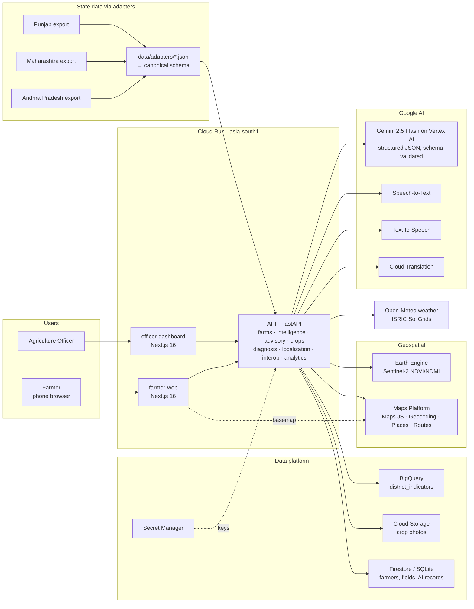

# Agri AI Network: AI-Powered Interoperable Digital Agriculture Network

Build with AI (Google) hackathon, Track 4. Full spec: [docs/PRD.md](docs/PRD.md) · Submission pack: [docs/SUBMISSION.md](docs/SUBMISSION.md) · Pitch deck: [docs/pitch/](docs/pitch/)

> **Agri AI Network gives a smallholder farmer one advisor for their own field.** It combines live weather,
> Soil Health Card data and satellite vegetation into a Farm Health score, then uses Gemini to turn that into a
> grounded advisory, crop options, and a photo-based Crop Doctor, in English, Hindi and Telugu, by voice or text.
> The same canonical data model and declarative state adapters let any Indian state plug in its own records and give
> agriculture officers a district-level risk view, without rebuilding the platform.

## Live URLs

| | URL |
|---|---|
| Farmer app | https://agri-ai-network-farmer-web-847963771142.asia-south1.run.app |
| Agriculture Officer dashboard | https://agri-ai-network-officer-dashboard-847963771142.asia-south1.run.app |
| API (OpenAPI docs at `/docs`) | https://agri-ai-network-api-847963771142.asia-south1.run.app |

> **Deployment status:** the images are built and verified locally with Docker and the deploy script is ready; the
> services go live when `infrastructure/cloud-run/deploy.sh` is run (pending approval at the time of writing).
> "Status" columns below describe what the deployed configuration runs, as verified against the same keys locally.

All three are Cloud Run services in `asia-south1`, deployed by [`infrastructure/cloud-run/deploy.sh`](infrastructure/cloud-run/README.md)
(the URLs are Cloud Run's deterministic `<service>-<project-number>.<region>.run.app` addresses).
`GET /api/system/status` on the API lists which integrations are live right now.

## Core journey (PRD §57 Priority 1, built end to end)

```text
Field (search village + draw on map, or pick a demo farmer)
 → Weather (Open-Meteo) + Soil (Soil Health Card via state adapter + ISRIC SoilGrids) + Satellite (Sentinel-2 NDVI)
 → Farm Intelligence + Farm Health score (weighted, explainable, never imputed)
 → Gemini advisory (observed → interpretation → recommendation, + one regenerative practice)
 → Crop recommendation (rule scores + Gemini explanation, ≥ 3 options, rotation plan)
 → Crop Doctor: leaf photo → Gemini multimodal → potential condition, confidence, next steps, nearest KVK (Maps)
 → English / हिन्दी / తెలుగు + voice question → spoken answer (Cloud Speech-to-Text / Text-to-Speech)
 → Agriculture Officer: India → state → district → block risk map, hotspots, human review of every AI output
```

**Users (exactly two roles):** Farmer (`apps/farmer-web`) and Agriculture Officer (`apps/officer-dashboard`), both on one API (`services/api`).

## Architecture



Every AI call goes through `generate_structured` (`services/api/app/ai/gemini.py`): the canonical field context
goes in, Pydantic-schema-validated JSON comes out, and the record stores `model_name`, `model_version`,
`prompt_version` (`ai/prompts/*_v1.md`). Gemini never invents measurements: observed data, AI interpretation and
recommendation are separate fields, and every data block carries source + timestamp.

## Google AI integration map (PRD §54)

| Google technology | Role in the product | Status in the deployed app |
|---|---|---|
| **Gemini 2.5 Flash (Vertex AI)** | Agro-advisory, crop-option explanation, voice Q&A, translation fallback | **Live** (service account, no API key needed) |
| **Gemini multimodal** | Crop Doctor: leaf/plant photo → potential condition, symptoms, confidence | **Live** |
| **Cloud Speech-to-Text** | Farmer's spoken question (en-IN / hi-IN / te-IN) | **Live** |
| **Cloud Text-to-Speech** | Spoken answers and advisories | **Live** |
| **Cloud Translation** | Localising Gemini advisories to Hindi / Telugu without re-analysis | **Live** |
| **Maps Platform: Geocoding / Places / Routes** | Village search, field address, nearest KVK / agriculture office with drive time | **Live** |
| **Maps JavaScript API** | Satellite basemap for drawing fields and the officer risk map | Live on `*.run.app` (Leaflet + OSM fallback if the key is rejected) |
| **BigQuery** | Regional indicators for the officer dashboard (`district_indicators`) | **Live** (rows are the labelled synthetic sample) |
| **Cloud Storage** | Crop Doctor photos (private bucket, streamed by the API) | **Live** |
| **Cloud Run + Secret Manager + Cloud Build + Artifact Registry** | Hosting, secrets, builds | **Live** |
| **Earth Engine** | Sentinel-2 SR NDVI/NDMI time series + thumbnail for the field polygon | Code complete; **demo** until the project's Earth Engine registration is approved |
| **Firebase / Firestore** | Document store (farmers, fields, AI records) | Code complete; **demo** (SQLite) until Firebase is added to the project |
| **Google AI Studio (Gemini API key)** | Alternative Gemini backend | Optional: `gemini-api-key` secret is attached automatically when it exists |

## Demo mode vs real integrations

Every integration works for real when configured and otherwise falls back to a clearly labelled demo path. The API
**probes each configured integration with a cheap real call** (cached 10 min), so a key that is set but not working
(e.g. Earth Engine not registered yet) is reported as demo with the reason, never as live. The header of both apps
shows *"N integrations live"* and *"Demo mode · M on fallback"*; the expandable panel lists both. Data blocks carry
their own `Live` / `Sample · synthetic` badges.

| Variable (repo `.env` unless noted) | Switches on | Fallback when empty or failing |
|---|---|---|
| `GOOGLE_GENAI_USE_VERTEXAI=true` + `GOOGLE_CLOUD_PROJECT` (or `GEMINI_API_KEY`), model `GEMINI_MODEL` | Gemini advisory, crop explanations, Crop Doctor (multimodal), voice Q&A | Deterministic rules (`model_name=demo-rules`); Crop Doctor returns per-crop fixtures and says the photo was **not** analysed |
| `GOOGLE_CLOUD_LOCATION` | Vertex AI region (`asia-south1`) | - |
| `GOOGLE_APPLICATION_CREDENTIALS` | Local dev only: service-account key for Google Cloud clients (Cloud Run uses its service account) | ADC |
| `EARTH_ENGINE_PROJECT` | Sentinel-2 SR NDVI/NDMI series for the field polygon + NDVI thumbnail | Sample NDVI series per state scenario |
| `USE_PUBLIC_APIS=true` (default, keyless) | Open-Meteo weather (14-day history, 7-day forecast, soil moisture); ISRIC SoilGrids texture | Sample weather/texture (also used automatically if the APIs are unreachable) |
| `MAPS_API_KEY` | Geocoding (village search, field address), Places + Routes (nearest KVK with drive time) | Pick the district from the list; no nearest-KVK lookup |
| `GOOGLE_CLOUD_API_KEY` | Cloud Translation, Speech-to-Text, Text-to-Speech | Gemini translation / built-in en-hi-te catalogue; browser Web Speech API |
| `FIREBASE_PROJECT_ID` (+ ADC) | Firestore document store | Local SQLite (`services/api/.data/`) |
| `GOOGLE_CLOUD_PROJECT` + `BIGQUERY_DATASET` | Officer analytics from BigQuery `district_indicators` | Synthetic district sample file |
| `GCS_BUCKET` | Crop photos stored in Cloud Storage | Local disk |
| `CORS_ORIGINS` | Extra allowed browser origins (the Cloud Run frontends are always allowed) | localhost :3040/:3041 |
| `NEXT_PUBLIC_API_URL` (`apps/*/.env.local`) | API base URL for the browser | `http://localhost:8040` |
| `NEXT_PUBLIC_MAPS_API_KEY` (`apps/*/.env.local`) | Google Maps satellite basemap (referrer-restricted browser key) | Leaflet + OpenStreetMap |

Soil NPK/pH/OC always come from the state's Soil Health Card style records (sample exports mapped by the adapters);
replacing those exports with real state feeds is a data change, not a code change. What stays sample even in
production: state farmer/field/soil exports, district indicators (served from BigQuery but synthetic), the NDVI
series until Earth Engine is registered, and the synthetic leaf photo.

## Run locally

```bash
cp .env.example .env                      # every key is optional - see the table above
for a in apps/*; do cp $a/.env.example $a/.env.local; done
pnpm install
(cd services/api && uv sync)

pnpm dev:api                 # http://localhost:8040  (OpenAPI docs at /docs, status at /api/system/status)
pnpm dev:farmer-web          # http://localhost:3040
pnpm dev:officer-dashboard   # http://localhost:3041
```

The API seeds three demo farmers per state on startup by running each state's sample export through its adapter.
Local data lives in `services/api/.data/` (SQLite + uploaded images; delete it to reset). Optional: load the
officer indicators into BigQuery with `cd services/api && uv run python ../../data/transformations/load_bigquery.py`.

Containers: `docker build -f services/api/Dockerfile .` and `docker build -f apps/<app>/Dockerfile .` from the repo
root. Deploy everything: `infrastructure/cloud-run/deploy.sh` ([details](infrastructure/cloud-run/README.md)).

### Demo script (PRD §44)

The timed, scene-by-scene script against the live URLs is in [docs/SUBMISSION.md](docs/SUBMISSION.md#demo-video-script-4-min-45-s).
Short version: pick *Lakshmi Devi · Groundnut · AP* → intelligence + Farm Health → *Generate advisory* → crop
options → Crop Doctor with *Use sample leaf photo* (nearest KVK appears) → switch to తెలుగు and ask by voice →
officer dashboard: risk map, hotspots, approve the advisory → *Interoperability* tab: AP / MH / PB → same canonical record.

## State onboarding story (PRD §40)

A state joins the network with **a config file and a data export, not code**:

1. **Register the state**: `data/adapters/<state>.json` names the source system, districts (with aliases), default language.
2. **Map local fields**: declarative field paths (`kisan_code → farmer_id`, `zila → district`, `khasra → field_id`).
3. **Normalise codes and units**: crop code tables (`kanak → wheat`, `kapus → cotton`, `GN → groundnut`), kanal/ha → acres,
   g/kg → %, kg/acre → kg/ha, local date formats, language fallbacks (Punjabi → Hindi until enabled).
4. **Validate** against the canonical Pydantic models (`data/schemas/*.schema.json`); bad rows fail loudly.
5. **Everything downstream is shared**: Farm Health, Gemini advisory, crop recommendation, Crop Doctor,
   voice and the officer dashboard run unchanged on the canonical records.

The prototype ships three: **Andhra Pradesh** (groundnut, e-Crop + Soil Health Card format, Telugu),
**Maharashtra** (cotton, MahaDBT format, Marathi → Hindi fallback) and **Punjab** (wheat, land records + PAU soil
lab format, Punjabi → Hindi fallback). The officer *Interoperability* tab shows raw record → adapter mapping →
identical canonical record side by side. The same pattern ports beyond India: a BRICS partner's ministry would add
its own adapter, language and crop codes on the same schema and APIs.

## Farm Health score (PRD §11)

`Farm Health = Vegetation × 30% + Soil × 25% + Weather × 20% + Water × 15% + Crop condition × 10%`
(`services/api/app/intelligence/health.py::WEIGHTS`). Bands: ≥ 75 Good, 50-74 Moderate, < 50 Poor.

- **Vegetation**: latest NDVI ÷ expected NDVI for the crop's stage at that date; −10/−20 if NDVI fell ≥ 0.05/0.10 in ~30 days.
- **Soil**: pH vs crop range (40), organic carbon (30), N/P/K Soil Health Card ratings (10 each).
- **Weather**: starts at 100; penalties for heat near the crop threshold, heavy rain (IMD 64.5 mm), humidity ≥ 85 %, strong wind, frost.
- **Water**: 14-day rain (+ irrigation credit) vs 14-day crop need; waterlogging, topsoil moisture and forecast-rain adjustments.
- **Crop condition**: from the latest Crop Doctor result (≤ 30 days).

A factor with missing inputs is shown as *missing* and its weight is redistributed; values are never imputed.

## Trust and safety

- Every AI output (advisory, crop recommendation, diagnosis) starts as `pending_officer_review`; the officer approves
  or rejects it and the farmer sees the status.
- Crop Doctor is always a *preliminary, AI-assisted* assessment with a disclaimer, low-confidence / high-severity
  results are flagged for expert review, and the nearest KVK / agriculture office is shown with drive time.
- Sample and synthetic data are labelled in the data files (`is_sample`, `is_synthetic`) and in the UI.
- No secrets in git: keys live in `.env` locally and in Secret Manager on Cloud Run; crop photos stay in a private bucket.

## Tests and checks

```bash
pnpm test:api   # pytest: Farm Health, adapters, API endpoints, integration status, demo-mode end-to-end journey
pnpm lint
pnpm build
```

## API (selected, PRD §37)

`POST /api/farmers` · `POST /api/fields` · `GET /api/geocode?q=` · `GET /api/fields/{id}/intelligence|weather|soil|satellite|health|nearby-support` ·
`POST /api/advisory/generate` · `POST /api/advisories/{id}/localize` · `POST /api/crop-recommendation` ·
`POST /api/diagnosis` · `POST /api/ask` · `POST /api/translate|speech-to-text|text-to-speech` ·
`GET /api/states`, `/api/states/{id}/analytics`, `/api/states/{id}/adapter-demo`, `/api/districts/{id}/risks` ·
`GET /api/review-queue` · `POST /api/reviews/{kind}/{id}` · `GET /api/system/status`

## Known gaps

- No authentication yet; the two roles are separate apps. Firebase Auth is the planned path.
- Until Firestore is enabled, the API keeps records in per-instance SQLite (Cloud Run `max-instances=1`; data resets on a cold start, demo farmers are re-seeded).
- Earth Engine NDVI is sample data until the project's Earth Engine registration is approved (code path is complete).
- Regional indicators and state exports are synthetic samples until real feeds are connected.
- Hindi/Telugu UI strings are hand-written and need native-speaker review; Marathi/Punjabi fall back to Hindi.
- Crop requirement ranges are indicative, not validated agronomic advice.

## Layout

| Path | Purpose |
|---|---|
| `apps/farmer-web/` | Farmer app (Next.js, Dockerfile for Cloud Run) |
| `apps/officer-dashboard/` | Agriculture Officer dashboard (Next.js, Dockerfile for Cloud Run) |
| `services/api/app/` | FastAPI: `farms/` (incl. Maps), `intelligence/` (weather, soil, satellite, health), `advisory/`, `crops/`, `diagnosis/`, `localization/`, `interop/`, `analytics/`, `ai/` |
| `ai/` | Versioned prompts and exported output schemas |
| `data/` | Canonical schemas, state adapters, labelled sample data, generator and BigQuery loader |
| `infrastructure/cloud-run/` | `deploy.sh` (all services), `cloudbuild.yaml`, deployment notes |
| `docs/` | PRD, submission pack, pitch deck |
